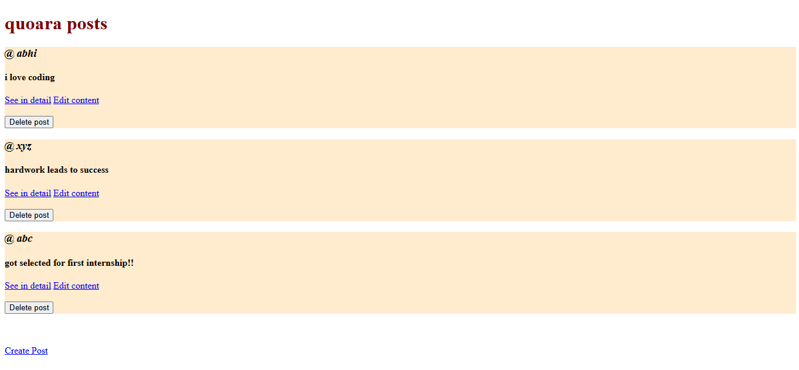
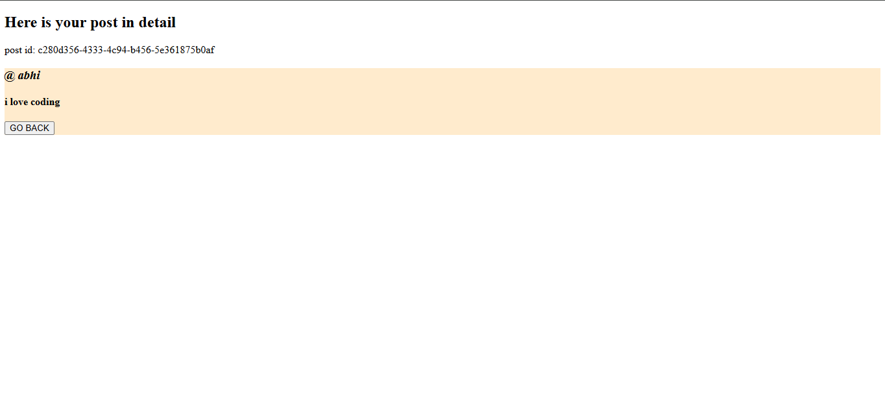
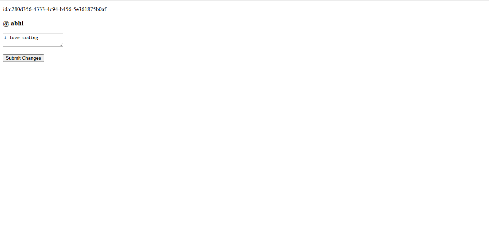

# 📝 RESTful Blog Posts API

A mini backend project built to learn and practice **Node.js**, **Express.js**, **EJS**, and **RESTful API** design. It implements full **CRUD** functionality for blog-style posts using in-memory storage.

---

## 📌 About the Project

This project simulates a simple social post feed where users can create, view, edit, and delete posts. It was built as a hands-on exercise to understand how RESTful routes work in Express, how EJS renders dynamic views server-side, and how HTTP methods like PATCH and DELETE are handled in HTML forms using `method-override`.

---

## ✨ Features

- View all posts on a feed
- Create a new post with a username and content
- View a single post in detail
- Edit/update an existing post
- Delete a post
- Unique IDs for each post using **UUID**
- Method override support for PATCH & DELETE from HTML forms

---

## 🛠️ Built With

| Technology      | Purpose                               |
| --------------- | ------------------------------------- |
| Node.js         | JavaScript runtime                    |
| Express.js v5   | Web framework and routing             |
| EJS             | Server-side HTML templating           |
| UUID            | Generating unique post IDs            |
| method-override | Enabling PATCH & DELETE in HTML forms |

---

## 🔁 RESTful Routes

| Method | Route             | Description                |
| ------ | ----------------- | -------------------------- |
| GET    | `/posts`          | Show all posts             |
| GET    | `/posts/new`      | Form to create a new post  |
| POST   | `/posts`          | Submit and save a new post |
| GET    | `/posts/:id`      | Show a single post         |
| GET    | `/posts/:id/edit` | Form to edit a post        |
| PATCH  | `/posts/:id`      | Update an existing post    |
| DELETE | `/posts/:id`      | Delete a post              |

---

## 📁 Project Structure

```
rest/
│
├── index.js              # Main server file — all routes defined here
├── package.json          # Project metadata and dependencies
├── package-lock.json     # Dependency lock file
├── views/                # EJS templates
│   ├── index.ejs         # All posts feed
│   ├── show.ejs          # Single post view
│   ├── new.ejs           # Create post form
│   └── edit.ejs          # Edit post form
└── public/               # Static assets (CSS, JS)
```

---

## 🚀 Getting Started

**Prerequisites:** Make sure you have [Node.js](https://nodejs.org) installed.

```bash
# 1. Clone the repository
git clone https://github.com/AbhineethVS/RESTful-Blog-Posts-API 
cd RESTful-Blog-Posts-API

# 2. Install dependencies
npm install

# 3. Start the server
node index.js
```

Then open your browser and go to:

```
http://localhost:8080/posts
```

---

## 📚 What I Learned

- How to set up an **Express.js** server from scratch
- Defining and organizing **RESTful routes** (GET, POST, PATCH, DELETE)
- Rendering dynamic pages server-side with **EJS templates**
- Passing data between the server and views
- Using **UUID** to generate unique IDs for each resource
- Using **method-override** to simulate PATCH and DELETE requests from HTML forms
- Handling URL parameters (`req.params`) and form data (`req.body`)

---

## 📸 Screenshots

/posts (home page)


/posts/:id (post in detail)


/posts/new (add new post)


/posts/:id/edit (edit a post)


---

## ⚠️ Note

This project uses **in-memory storage** (a plain JavaScript array), so all data resets when the server restarts. A database like MongoDB or PostgreSQL would be the next step for persistent storage.

---
